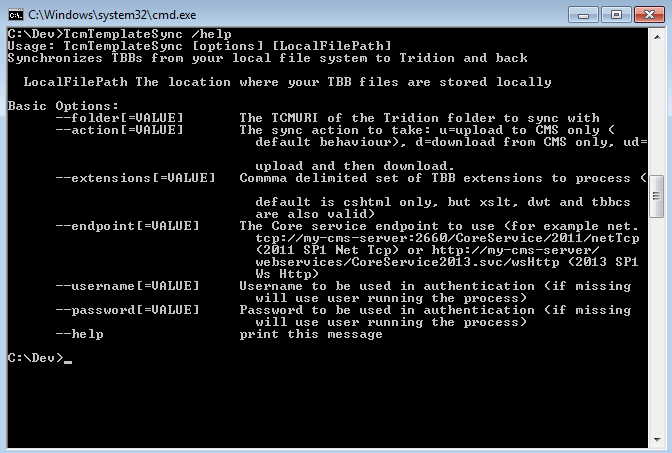

# TcmTemplateSync.exe #

This tool can be used to bulk synchronize local Template Building Block (TBB) Files with the Tridion CMS. It uses the Core Service, updating the TBBs in the CMS based on whether the file modified date is more recent than the CMS Last Modified date (an offset is automatically calculated by comparing the local and server times). 

There is also an option to download TBBs from the CMS to the local file system.

By using this tool, you can edit your TBBs in the most appropriate development environment rather than the CMS GUI and use that environment to compile/validate them before uploading. You can hook it in as a build step, or menu option, or even via source control for continuous integration. It uses the Core Service, rather than webdav, so you will get meaningful error messages when attempting to upload invalid data (for example for C#, XSLT or Razor TBBs).

## Usage ##
Put **TcmTemplateSync.exe** along with **Tridion.ContentManager.CoreService.Client.dll** in a directory on your local machine and run it from the command line, passing (as a minimum) the following arguments:

- **folder** :The tcm uri of the folder to Sync with in the CMS
- **endpoint** :The address of your core service endpoint (wsHttp, netTcp or basicHttp)
- The path to the local folder you are synchronizing

    TcmTemplateSync /folder:tcm:10-203-2 /endpoint:http://cms/webservices/CoreService2013.svc/wsHttp 
    	"D:\Dev\Layouts\"

`TcmTemplateSync /help` gives full options:

The tool uses Mono.Options for command line argument parsing, so you can pass argument values by using `/` or `--` separating the argument name and value with a `=` or a `:`

## Supported Versions/TBB Types ##
The tool was developed and tested using Tridion 2013 SP1, but should work with all 2011+ versions (it may require a re-compile - I'm not sure and too lazy to test it). 

You can use it to sync Razor, XSLT, Dreamweaver and C# TBBs. I deliberately have not added support for VBScript and JScript TBBs, as I dont want to encourage use of these crappy old technologies, but a couple of lines added to the code will get you up and running with these too if you are unfortunate enough to be enslaved in a project working with these.

